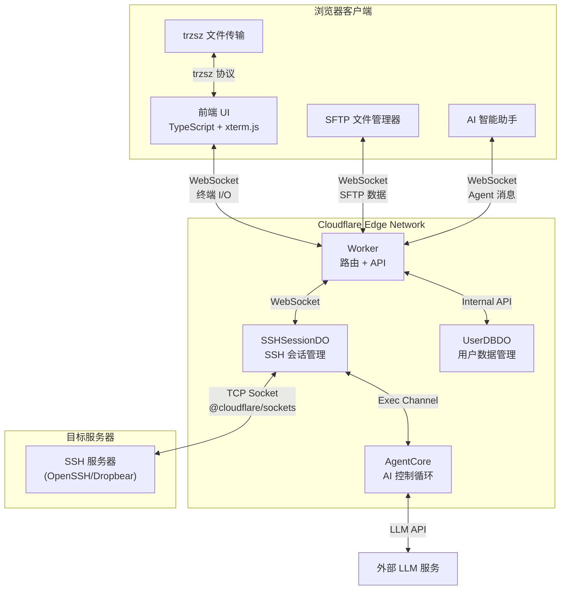

  
  
一个基于 Cloudflare Workers 的 Serverless Web SSH 终端：通过浏览器直接连接和管理你的服务器。

  
<b>极致轻量 · 开箱即用 · 赛博朋克 UI</b>

  

    
    
    
    
    
  

  

    <a href="README.md">简体中文</a> |
    <a href="README_en.md">English</a>
  

> [!IMPORTANT]
> 功能演示、架构、安全边界、主题系统与部署流程已统一整理到 **[CloudSSH 项目介绍页](https://newbietan.github.io/CloudSSH/?lang=zh-CN)**。README 仅保留部分信息。

## 快速入口

| 入口         | 地址                                                                             |
| ------------ | -------------------------------------------------------------------------------- |
| 项目介绍主页 | [newbietan.github.io/CloudSSH](https://newbietan.github.io/CloudSSH/?lang=zh-CN) |
| 正式版本演示 | [ssh.newbietan.cn](https://ssh.newbietan.cn)                                     |
| 测试版本演示 | [sshtest.newbietan.cn](https://sshtest.newbietan.cn)                             |
| 在线主题编辑 | [Theme V2 Editor](https://cte.newbietan.cn/theme-editor/)                        |
| B 站演示视频 | [BV1UgMt6UEdF](https://www.bilibili.com/video/BV1UgMt6UEdF)                      |

## 项目简介

CloudSSH 在浏览器与目标服务器之间建立两段加密连接：浏览器通过 HTTPS/WSS 连接 Cloudflare，Worker 再通过原生 TCP Socket 建立完整 SSH-2.0 会话。每个活动会话由独立 Durable Object 管理，无需维护传统 VPS 中转服务。

核心能力包括：

- 纯 TypeScript SSH-2.0 协议栈，支持密码与 Ed25519、ECDSA、RSA 私钥认证。
- xterm.js 多标签终端、实时延迟、日志检索/导出和桌面/移动端适配。
- SFTP v3 图形化文件管理、批量操作、传输队列，以及 trzsz 文件传输。
- GitHub OAuth、已保存服务器、标签筛选、主机指纹 TOFU 校验与凭据加密存储。
- BYOK AI 运维助手、终端上下文、8 个工具和危险命令确认/拦截。
- Theme V2 内置主题、自定义 JSON 导入与登录账号同步。

更完整、图形化的介绍请查看[项目介绍页](https://newbietan.github.io/CloudSSH/?lang=zh-CN)，实现目录和维护约束见 [AGENTS.md](AGENTS.md)。

## 架构说明

### 系统架构

## 安全与隐私提示

- 建议为公开部署启用 Turnstile。
- 首次连接请人工核对服务器 SHA-256 Host Key 指纹；后续若指纹变化，请先排查再接受。
- 保存服务器时会通过第三方 IPinfo 推断目标主机区域，以优化 Durable Object 调度；失败时自动回退到 Cloudflare 默认位置。
- 部署者应自行审查代码、管理密钥，并遵守所在地区及目标服务器的安全要求。

## 参与项目

开发变更统一进入 `test` 分支，通过质量检查后再合入 `main`。

- [更新日志](CHANGELOG.md)
- [贡献者](https://github.com/newbietan/CloudSSH/graphs/contributors)
- [Issue](https://github.com/newbietan/CloudSSH/issues)
- [Apache License 2.0](LICENSE)
