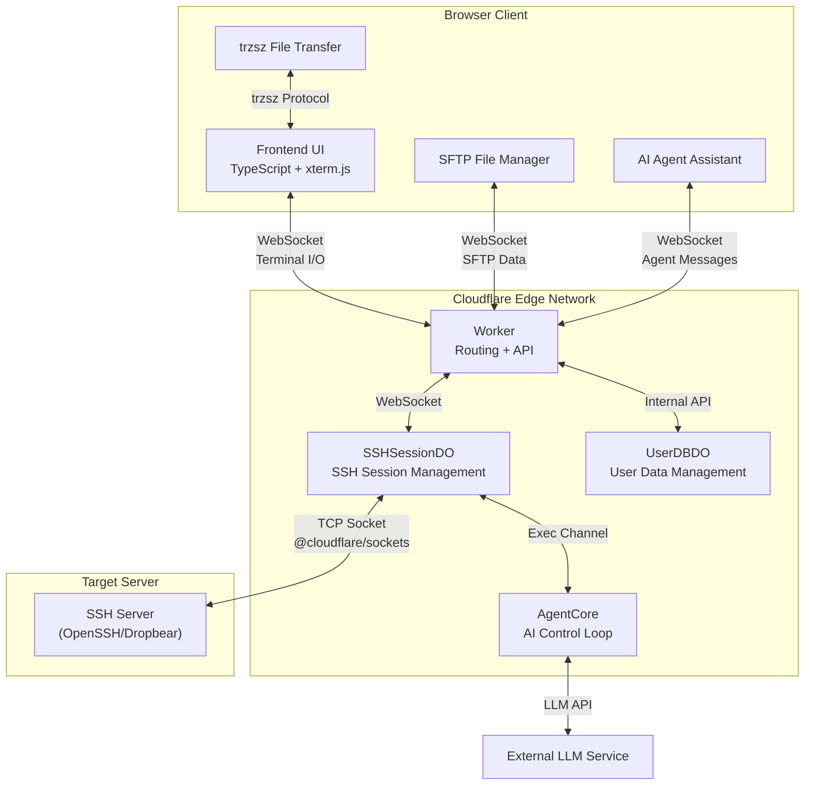

<div align="center">
  
  <p>A Serverless Web SSH Terminal built on Cloudflare Workers: Connect and manage your servers directly from the browser.</p>
  <p><b>Ultra-lightweight · Out-of-the-box · Cyberpunk UI</b></p>
  <p>
    <a href="https://github.com/newbietan/CloudSSH/stargazers"></a>
    <a href="LICENSE"></a>
    
    
    
  </p>
  <p>
    <a href="#highlights">Highlights</a> ·
    <a href="#features">Features</a> ·
    <a href="#quick-start">Deployment</a> ·
    <a href="#architecture">Architecture</a> ·
    <a href="CHANGELOG.md">Changelog</a> ·
    <a href="#contributors">Contributors</a> ·
    <a href="#license">License</a>
  </p>
  <p>
    <a href="README.md">简体中文</a> |
    <a href="README_en.md">English</a>
  </p>
</div>

> [!TIP]
> **CloudSSH** utilizes Cloudflare Workers' TCP Sockets support to handle SSH protocol parsing and forwarding at edge nodes, providing a low-latency Web Terminal experience.

## Demo

> Imagine opening your browser anytime, anywhere, and connecting to your server with a highly futuristic cyberpunk UI, without installing any SSH client.

<div align="center">
  <a href="https://www.bilibili.com/video/BV1UgMt6UEdF" target="_blank" title="Click to play video">
    
    <br/>
    
  </a>
  <p><sub>Video duration 8:27 · Full CloudSSH walkthrough</sub></p>
</div>

## Table of Contents

- [Highlights](#highlights)
- [Features](#features)
- [Architecture](#architecture)
- [Quick Deployment](#quick-start)
  - [GitHub Integration](#method-1-deploy-via-github-integration-recommended)
  - [Local CLI Deployment](#method-2-local-cli-deployment)
  - [Configure Turnstile](#optional-configure-turnstile-human-verification)
  - [Configure GitHub OAuth](#optional-configure-github-oauth-login--server-management)
- [Development](#development)
  - [Local Development](#local-development)
  - [Tech Stack](#tech-stack)
- [Contributors](#contributors)
- [License](#license)

<a id="highlights"></a>
## Highlights

### Ultimate Serverless

- **Zero Server Cost**: Pure frontend deployment + Cloudflare Workers, no need to build your own backend servers.
- **Edge Acceleration**: Benefit from Cloudflare's global edge network, enjoying low-latency SSH connections from anywhere.

### Out of the Box

- **One-Click Deployment**: Build and deploy the project with a single command using the Wrangler CLI.
- **Modern Frontend Stack**: TypeScript + Vite + Tailwind CSS, paired with xterm.js to provide a silky smooth terminal experience.

### Secure and Reliable

- **Encrypted Transport in Two Segments**: The browser-to-Cloudflare Worker segment uses HTTPS/WSS, while the Worker-to-target-host segment uses the complete SSH-2.0 protocol. The SSH segment supports Curve25519-SHA256 (preferred) and ECDH-NISTP256 key exchange, AES-256-GCM (preferred) / AES-128-GCM / AES-256-CTR encryption, and HMAC-SHA2-256/512 integrity verification.
- **Multi-Algorithm Host Key Verification**: Supports Ed25519, ECDSA P-256/P-384/P-521, and RSA signature verification, with SHA-256 fingerprint display on first connection (TOFU mode).
- **Security Hardening**: Built-in SSRF protection against IPv6 and reserved addresses. `/api/ssh` uses a bounded, per-Worker-isolate in-memory limiter for traffic shedding, while connection authorization remains the responsibility of Turnstile or one-time connection tokens. Saved server credentials are encrypted with AES-256-GCM in per-user Durable Object SQLite storage.
- **Human Verification**: Supports Cloudflare Turnstile verification to prevent malicious bot abuse.
- **Isolated Session State**: Each SSH terminal session is managed by an independent Cloudflare Durable Object. Browser WebSockets use the Hibernation API entry pattern, but an active outbound SSH TCP connection keeps the Durable Object awake for the duration of the session.
- **Internal Flow for Saved Credentials**: When connecting to a saved server, UserDBDO decrypts the credential on the server side and passes it internally to SSHSessionDO through a one-time connection token; the browser never receives the plaintext credential. Anonymous connections and the initial save still send user input to the Worker over HTTPS/WSS.

<a id="features"></a>
## Features

- **Pure TypeScript SSH-2.0 Implementation**: Fully self-developed SSH protocol stack, with no dependency on any third-party SSH libraries, implementing all cryptographic operations based on Web Crypto API.
- **Multi-Algorithm Key Exchange**: Supports Curve25519-SHA256 (preferred) and ECDH-NISTP256 KEX algorithms, compatible with various SSH servers (including Dropbear).
- **IPv4/IPv6 Dual Stack**: Full support for both IPv4 and IPv6 address connections, including automatic handling of IPv6 bracket notation.
- **Multiple Auth Methods**: Supports standard SSH password authentication and OpenSSH-format Ed25519, ECDSA P-256/P-384/P-521, and RSA private keys. RSA uses RSA-SHA2-256/512 by default; legacy `ssh-rsa` SHA-1 is allowed only through explicit compatibility configuration.
- **MitM Protection (TOFU)**: Automatically extracts and prints the server's Host Key (SHA-256 fingerprint) on the first connection, supporting Ed25519/ECDSA/RSA signature verification, and caches known host keys locally and via API to prevent MitM on future connections.
- **Geek Terminal Experience**: Powered by `@xterm/xterm` and the `@xterm/addon-webgl` hardware acceleration rendering engine, ensuring silky smooth scrolling even with massive log outputs.
- **Customizable UI**: Theme V2 includes Standard Dark, Standard Light, Cyberpunk, Glacier, and Gruvbox. The companion [GitHub Pages theme editor](https://newbietan.github.io/CloudSSH/) provides live controls for colors, shape, density, font, shadows, motion, and button/input/card/tab styles, with previews for login, server list, terminal + SFTP, and the AI Agent panel. Themes are imported, exported, backed up, and shared as JSON files. Signed-in users sync imported themes to their account for cross-browser restoration, while anonymous users keep them in the current browser only.
- **SFTP Graphical File Manager**: Integrated with a complete SFTP v3 file transfer protocol, providing a graphical file browser interface. Supports directory browsing, file upload/download, creating new folders, file renaming, and deletion, plus plain selection, `Cmd/Ctrl` toggle selection, `Shift` range selection, select all, batch file downloads, and batch deletion. Built on the SSH subsystem, it runs alongside terminal sessions without interference and supports download queues and upload cancellation.
- **Native File Transfer**: Integrated with [trzsz.js](https://github.com/trzsz/trzsz.js), supporting `trz` (upload) / `tsz` (download) commands for file transfer, fully compatible with tmux sessions. Also supports drag-and-drop file upload to the terminal, directory transfer, and resumable transfers. (Requires [trzsz](https://trzsz.github.io/) installed on the remote server)
- **GitHub OAuth Integration**: Supports GitHub login, allowing users to save and manage frequently used SSH servers for one-click connections. Each server can have up to 10 normalized tags; the list supports instant search by name, host, or username, tag filtering, and pagination with 9 server cards per page.
- **Single-Page Multi-Tab Session**: Switch between multiple independent SSH terminal and SFTP instances within a single browser tab, with isolated sandbox environments.
- **Secure Connection History**: Saves last 5 connection records locally. Credentials (passwords/private keys) can be client-side encrypted using locally derived AES-256-GCM keys.
- **Dual-Segment Latency & Colo Display**: Instantly and periodically monitor WebSocket RTT (client to CF), physical latency (CF to SSH host), and the current Cloudflare datacenter code (e.g. `CF-LAX`) on the status bar, with green, yellow, and red indicators for network quality.
- **Smart Region Scheduling (locationHint)**: Queries IPinfo when a server is saved, persists the inferred Durable Object region, and reuses it on connection without another runtime geo lookup. Failures fall back to Cloudflare's default placement, and users may override the region manually. *Note: automatic inference sends target-host information to the third-party IPinfo service. locationHint is a Cloudflare best-effort feature and may fall back to a nearby region when capacity is unavailable.*
- **In-Terminal Text Search**: Real-time log search support via `Ctrl+Shift+F`.
- **Terminal Log Export**: Download the entire screen buffer of the active terminal session as a `.txt` file with a single click on the header download button, avoiding browser freezes when selecting long logs.
- **AI Agent Assistant**: Built-in AI Agent sidebar with BYOK (Bring Your Own Key) support for OpenAI-compatible APIs (e.g., DeepSeek). Provides 8 specialized operations tools: execute commands, read terminal context, detect server environment, list processes, manage systemctl services, manage Docker containers, user confirmation, and structured report output. Selecting terminal text exposes an “Ask AI assistant” action that attaches the complete selection to the current tab's composer instead of sending it immediately. The attachment shows its source and size, can be expanded, replaced, or removed, and is sent only after the user adds a question. Terminal selections are explicitly treated as untrusted analysis data—not action authorization—and cannot override user instructions. Agent code blocks support one-click copy, while safe single-line Shell commands can be filled into the active terminal without being executed automatically. Supports LLM streaming output (character-by-character display). Dangerous commands are automatically blocked or require confirmation in a safe, reject-by-default dialog. **Thinking Process Container**: During multi-step tasks, displays the latest 1-2 commands in real-time, auto-collapses with total step count after completion, expands to show full execution history.
- **Quality Gates**: Before deploying either `test` or `main`, GitHub Actions performs frozen-lockfile installation, Worker/frontend type checking, unit and integration tests, reproducible frontend builds, Playwright browser E2E, and axe accessibility regression. Any failure blocks deployment.

<a id="architecture"></a>
## Architecture

### System Architecture



### Core Components

| Component | File | Responsibility |
|-----------|------|----------------|
| **Worker Entry** | `src/worker/index.ts` | HTTP routing, API handling, WebSocket upgrade |
| **SSHSessionDO** | `src/worker/durable-object.ts` | SSH session lifecycle management, SSRF protection |
| **UserDBDO** | `src/worker/user-db.ts` | Per-GitHub-user data, sessions, server configs, normalized tags, and encrypted credentials (SQLite) |
| **IP Geo Inference** | `src/worker/ip-geo.ts` | Infers target IP region at save time, maps to Cloudflare DO locationHint |
| **SSHSession** | `src/worker/ssh-session.ts` | SSH protocol state machine (connect→version→kex→auth→interactive) |
| **SSH Protocol Stack** | `src/ssh/*.ts` | Pure TypeScript SSH-2.0 implementation (transport, crypto, auth, channels) |
| **SFTP Handler** | `src/worker/sftp-handler.ts` | SFTP protocol operations, task queue, concurrent downloads, upload tracking and cancellation |
| **SFTP Protocol** | `src/ssh/sftp.ts` / `sftp-types.ts` | SFTP v3 protocol client, packet parsing and type definitions |
| **Frontend Terminal** | `frontend/src/terminal.ts` | xterm.js wrapper, dynamic RTT heartbeats, three-color network quality indicators, terminal search, selection-to-Agent actions, and WebSocket management |
| **Tab Manager** | `frontend/src/tab-manager.ts` | Single-page coordinator for isolated terminal, SFTP, Agent, and pending-context state in each session tab |
| **Server List** | `frontend/src/server-list.ts` | Server-card management, search, tag filtering, and pagination with 9 items per page |
| **SFTP Panel** | `frontend/src/sftp-panel.ts` | Graphical file manager UI with multi-selection, batch download/delete, transfer queues, and cancellation |
| **AI Agent** | `src/worker/agent/core.ts` | AI control loop: LLM streaming calls, tool execution, environment detection, terminal context reading |
| **Agent Tools** | `src/worker/agent/tools.ts` | 8 operations tools (execute command, terminal context, environment detection, process list, service management, Docker management, user confirmation, report output) |
| **Agent Safety** | `src/worker/agent/safety.ts` | Two-layer security: direct blocking (rm -rf /, fork bomb, etc.) + confirmation prompts (rm, shutdown, iptables, etc.) |
| **Agent Panel** | `frontend/src/agent/agent-panel.ts` | AI assistant sidebar UI with terminal-selection attachments, streaming output, Markdown rendering, code-block copy and safe terminal fill, collapsible thinking process, and safe confirmation dialogs |
| **Agent Selection Context** | `frontend/src/agent/terminal-selection-context.ts` | Preserves terminal-selection snapshots and composes user questions with an explicit untrusted-data boundary |
| **AI Config** | `frontend/src/ai-config.ts` | AI model configuration modal for Base URL / API Key / model selection |
| **Region Options** | `frontend/src/regions.ts` | Shared DO locationHint region options component for server management and anonymous connection forms |

### SSH Protocol Implementation

This project implements a complete SSH-2.0 protocol stack:

| Layer | Implementation | Supported Algorithms |
|-------|----------------|---------------------|
| **Key Exchange** | `kex-curve25519.ts` / `kex-ecdh.ts` | curve25519-sha256, ecdh-sha2-nistp256 |
| **Data Encryption** | `crypto.ts` | aes256-gcm, aes128-gcm, aes256-ctr, aes192-ctr, aes128-ctr |
| **Integrity** | `crypto.ts` | hmac-sha2-256, hmac-sha2-512, hmac-sha1 |
| **Host Keys** | `ssh-session.ts` | Ed25519, ECDSA P-256/P-384/P-521, RSA |
| **User Auth** | `auth.ts` | Password; Ed25519, ECDSA P-256/P-384/P-521, and RSA-SHA2 private-key authentication |
| **Channel Management** | `channel.ts` | Session channel, SFTP subsystem, PTY, shell, window-change |
| **SFTP Protocol** | `sftp.ts` / `sftp-types.ts` | SFTP v3 file transfer protocol (directory browsing, upload, download, delete, rename) |

### Data Flow

1. The user enters the host IP, username, and password on the frontend (or selects a saved server via GitHub OAuth).
2. The frontend establishes a WebSocket connection with the backend Durable Object.
3. SSHSessionDO receives the credentials and establishes a TCP connection with the target SSH server using `@cloudflare/sockets`.
4. SSHSession executes the complete SSH protocol negotiation (version exchange → key exchange → authentication → channel open → PTY → Shell).
5. Terminal data travels over WSS between the browser and Worker, and over SSH between the Worker and target server; the Worker bridges the two protocol segments and processes SSH.
6. SFTP file management runs on a separate SSH subsystem channel, supporting directory browsing, file upload/download, and other operations.
7. The AI Agent receives the user question and optional terminal-selection context via WebSocket. The selection is marked as untrusted analysis data before AgentCore calls the external LLM API, executes approved commands through SSH exec channels, and streams results back to the frontend.

<a id="quick-start"></a>
## Quick Deployment

### Prerequisites

- A Cloudflare account.
- Node.js 22 environment (matching the project CI).
- Cloudflare Workers Free Plan enabled (required for TCP Sockets and Durable Objects features).

### Steps

#### Method 1: Deploy via GitHub Integration (Recommended)

<div align="center">
  <a href="https://dash.cloudflare.com/?url=https://github.com/newbietan/CloudSSH">
    
  </a>
  <p>Click the button to jump to the Cloudflare console — authorize your GitHub account and deploy automatically, no local environment required</p>
</div>

1. **Fork this repository** to your GitHub account.
2. **Create Worker App**: Log in to Cloudflare, go to Workers & Pages, click Create Application, connect your GitHub account, and select the forked repository.
3. **Build Command**: During deployment settings, enter `pnpm run build:frontend` as the Build command, then save and deploy.
4. **Access the App**: After successful deployment, access via the default domain `https://cloudssh.<your-subdomain>.workers.dev`.
5. **Bind Custom Domain** (Optional): Go to Worker Settings → Domains & Routes → Add, enter your domain and confirm.

> **Note**: To deploy a test environment, repeat the above steps on the `test` branch to create a separate Worker (e.g., `cloudssh-test`). The Durable Objects data between both environments is completely isolated.

#### Method 2: Local CLI Deployment

1. **Clone the Repository**
   ```bash
   git clone https://github.com/newbietan/CloudSSH.git
   cd CloudSSH
   ```

2. **Install Dependencies**
   ```bash
   npm install -g pnpm
   pnpm install
   cd frontend && pnpm install
   ```

3. **Login to Cloudflare**
   ```bash
   npx wrangler login
   ```

4. **Deploy Production**
   ```bash
   pnpm run deploy
   ```

5. **Deploy Test Environment** (Optional)
   ```bash
   pnpm run deploy:test
   ```

| Environment | Command | Default Domain | Description |
|-------------|---------|---------------|-------------|
| Production | `pnpm run deploy` | `cloudssh.<subdomain>.workers.dev` | main branch code |
| Test | `pnpm run deploy:test` | `cloudssh-test.<subdomain>.workers.dev` | test branch code, DO data isolated from production |

> **Note**: Both environments bind to Durable Objects with the same `class_name`, but data is completely isolated due to different Worker names. After deployment, you can bind different custom domains for each environment in the Cloudflare Dashboard (Settings → Domains & Routes).

#### Optional: Configure Turnstile Human Verification

To prevent malicious bot abuse, it is recommended to enable Cloudflare Turnstile verification:

1. **Create Turnstile Widget**: Log in to [Cloudflare Dashboard](https://dash.cloudflare.com/), go to the Turnstile page and create a new Widget.
2. **Get Keys**: After creation, you will receive a **Site Key** (public) and a **Secret Key** (private).
3. **Configure Environment Variables**: In the Cloudflare Dashboard Workers settings, go to "Settings" → "Variables and Secrets", add the following environment variables:
   - `TURNSTILE_SECRET` = your Secret Key
   - `TURNSTILE_SITEKEY` = your Site Key
4. **Redeploy**: Run the deployment command to apply the configuration.

> **Environment Variable Type Recommendation**: It is recommended to set all environment variables as **Secret** type. Secrets are stored in Cloudflare's encrypted storage, separate from code deployments, and will not be overwritten or lost during redeployments. When adding variables in the Dashboard, simply select the "Secret" type.

> **Note**: Turnstile verification is session-level. After verification, all features are available for the current session. Closing the browser will require re-verification.

#### Optional: Configure GitHub OAuth Login & Server Management

With GitHub OAuth enabled, users can log in with their GitHub account and save/manage their frequently used SSH servers in a personal dashboard for one-click connections. When not configured, this feature is automatically hidden and does not affect the anonymous SSH connection functionality.

1. **Create a GitHub OAuth App**:
   - Go to GitHub → Settings → Developer settings → OAuth Apps → [New OAuth App](https://github.com/settings/applications/new)
   - **Application name**: `CloudSSH` (customizable)
   - **Homepage URL**: `https://your-domain.com` (your deployed domain)
   - **Authorization callback URL**: `https://your-domain.com/api/auth/callback`
   - After creation, note the **Client ID**, then click **Generate a new client secret** to get the **Client Secret** (shown only once, save it immediately)

2. **Configure Environment Variables**: In the Cloudflare Dashboard Workers settings, go to "Settings" → "Variables and Secrets", add the following environment variables:
   - `GITHUB_CLIENT_ID` = your Client ID
   - `BASE_URL` = `https://your-domain.com` (your deployed domain)
   - `GITHUB_CLIENT_SECRET` = your Client Secret

3. **Redeploy**: Save the variables and redeploy the existing Worker. The Durable Object migration in the repository initializes the required classes and database; deleting the existing Worker is not required.

> **Environment Variable Type Recommendation**: It is recommended to set all environment variables as **Secret** type. Secrets are stored in Cloudflare's encrypted storage, separate from code deployments, and will not be overwritten or lost during redeployments. When adding variables in the Dashboard, simply select the "Secret" type.

> **Note**: Server credentials (passwords/private keys) are encrypted with AES-256-GCM in each user's UserDBDO SQLite database. The current encryption key is generated on first use and stored in the same Durable Object database as the ciphertext. This prevents plaintext storage but does not protect against compromise of the entire database. For a saved-server connection, the browser never receives the plaintext credential; the server side transfers it internally through a one-time connection token.

> **Migration note**: Existing deployments should evolve Durable Objects through new, never-reused migration tags in `wrangler.toml`. Delete a Worker only when the environment contains no data that must be retained and you intentionally want to rebuild the entire environment; deletion is not a normal production initialization step.

<a id="development"></a>
## Development

### Project Structure

This project uses pnpm monorepo workspace structure:

```
CloudSSH/
├── src/                    # Backend source (Cloudflare Worker)
│   ├── ssh/                # SSH protocol pure implementation layer
│   └── worker/             # Worker entry and Durable Objects
├── frontend/               # Frontend source (independent workspace)
│   └── src/                # TypeScript + xterm.js + trzsz
├── docs/                   # GitHub Pages static assets
│   └── theme-editor/       # Visual theme editor
├── scripts/                # Build scripts
├── tests/                  # Vitest, Playwright, and axe regression tests
├── .github/workflows/      # CI quality gates and deployment workflows
├── pnpm-workspace.yaml     # pnpm workspace configuration
└── wrangler.toml           # Cloudflare deployment configuration
```

### Local Development

#### Environment Setup

1. **Fork and Clone the Repository**
   ```bash
   git clone https://github.com/<your-username>/CloudSSH.git
   cd CloudSSH
   ```

2. **Install Dependencies** (root and frontend separately)
   ```bash
   pnpm install
   cd frontend && pnpm install
   ```

3. **Login to Cloudflare** (required on first run, credentials are cached afterward)
   ```bash
   npx wrangler login
   ```
   > **Note**: When using Wrangler Dev for local development, it connects to your Cloudflare account to access Durable Objects and TCP Sockets. Real SSH TCP traffic is forwarded through Cloudflare's infrastructure.

4. **Configure GitHub Actions** (Optional, for automatic deployment)
   
   If you want to deploy to your own Cloudflare account via GitHub Actions, modify the repository owner in `.github/workflows/deploy.yml`:
   ```yaml
   if: github.repository_owner == 'your-github-username'
   ```
   Also configure the following Secrets in your repository Settings → Secrets and variables → Actions:
   - `CLOUDFLARE_API_TOKEN`: Your Cloudflare API Token
   - `CLOUDFLARE_ACCOUNT_ID`: Your Cloudflare Account ID

#### Start Development Server

```bash
pnpm run dev
```

This command builds the frontend and starts the Wrangler local development environment, supporting:
- Automatic rebuild on frontend code changes
- Automatic reload on Worker code changes
- Full Durable Objects and TCP Sockets functionality

After the dev server starts, visit the local address shown in the terminal (usually `http://localhost:8787`) to start debugging.

#### Common Development Commands

| Command | Description |
|---------|-------------|
| `pnpm run dev` | Build frontend + start Wrangler dev server |
| `pnpm run build:frontend` | Build frontend only (output to `frontend/dist/`) |
| `pnpm run typecheck` | Type-check Worker and frontend TypeScript |
| `pnpm test` | Run Vitest unit and integration tests |
| `pnpm run test:e2e` | Run Playwright browser E2E and axe accessibility tests |
| `pnpm run verify` | Run type checks, tests, production build, and browser E2E |
| `pnpm run deploy:test` | Build and deploy the isolated test environment |

#### Submitting Changes

**Do NOT create feature branches.** All changes must be committed directly to the `test` branch to keep the repository clean.

```
test branch (dev/test)  ──merge──>  main branch (production)
```

1. Switch to the `test` branch: `git checkout test`
2. Pull the latest code: `git pull origin test`
3. Develop and test locally
4. Commit and push directly: `git push origin test`
5. After testing passes, the maintainer will merge `test` into `main`

> **Note**: The `main` branch has protection rules that prevent direct pushes. All changes must be committed to the `test` branch first. Do NOT create `feat/xxx`, `fix/xxx` or any other feature branches — commit directly to `test`.

### Tech Stack

| Layer | Technology | Description |
|-------|------------|-------------|
| **Frontend** | TypeScript + Vite + xterm.js | Web terminal emulator, WebGL hardware acceleration |
| **UI Framework** | Tailwind CSS (local Vite/PostCSS build) + Theme V2 | The app supports built-in theme switching, custom JSON import, and signed-in account sync; editing and export live on GitHub Pages |
| **File Transfer** | trzsz.js | Supports trz/tsz commands, drag-and-drop upload, resumable transfers |
| **AI Assistant** | BYOK + OpenAI-compatible API | Bring your own API key, supports DeepSeek and other compatible models |
| **Backend** | Cloudflare Workers | Serverless edge computing |
| **Session Management** | Durable Objects | SSH session isolation; browser WebSockets use the Hibernation API entry pattern, while active outbound TCP prevents hibernation |
| **Data Storage** | Durable Objects SQLite | User data, server configurations |
| **Package Manager** | pnpm (workspace) | Monorepo dependency management |

<a id="contributors"></a>
## Contributors

Thank you to the following contributors for improving CloudSSH's code, compatibility, and user experience:

| Contributor | Key Contributions |
|-------------|-------------------|
| [TanXin (@newbietan)](https://github.com/newbietan) | Project creator, core architecture, and ongoing maintenance |
| [David xu (@xqdoo00o)](https://github.com/xqdoo00o) | Dropbear compatibility, trzsz file transfer, PTY and session interaction improvements |
| [vonl1 (@vonl1)](https://github.com/vonl1) | Terminal selection auto-copy and right-click paste experience |

This list is based on the Git commit history. See [GitHub Contributors](https://github.com/newbietan/CloudSSH/graphs/contributors) for the complete record. Issues and Pull Requests are welcome.

<a id="license"></a>
## License

This project is open-sourced under the [Apache License 2.0](LICENSE). 

**Original Author and Attribution Requirement**: CloudSSH was initiated and architected by [TanXin (@newbietan)](https://github.com/newbietan), who continues to maintain the project. Any modified, derivative, or redistributed version based on this project must retain the license, copyright, and attribution notices in [LICENSE](LICENSE) and [NOTICE](NOTICE), and clearly state in its documentation or other accompanying notices: “This project is based on CloudSSH, originally created by TanXin (@newbietan),” together with a link to the original project.

Commercial use, modification, and redistribution remain governed by the [Apache License 2.0](LICENSE). The attribution requirement above preserves the source and authorship of the original project without restricting other rights granted by the license.

Issues and Pull Requests are welcome to help build the community. If you find this project helpful, please consider giving it a ⭐ Star. Thank you very much for your support!

## Star History

<a href="https://www.star-history.com/?repos=newbietan%2FCloudSSH&type=date&legend=top-left">
 <picture>
   <source media="(prefers-color-scheme: dark)" srcset="https://api.star-history.com/chart?repos=newbietan/CloudSSH&type=date&theme=dark&legend=top-left&sealed_token=W6EXioqdcb2BEJNCLBVZIvRGDUYCaxki-xY1FfDVex2S8hS-ABAc84mDRxLIx0wQLFCd3Wh_p-t4bD4yT_iPkhi0_7Aciixag0Vj0_Qsqv3Wh_pbiD6Ykw" />
   <source media="(prefers-color-scheme: light)" srcset="https://api.star-history.com/chart?repos=newbietan/CloudSSH&type=date&legend=top-left&sealed_token=W6EXioqdcb2BEJNCLBVZIvRGDUYCaxki-xY1FfDVex2S8hS-ABAc84mDRxLIx0wQLFCd3Wh_p-t4bD4yT_iPkhi0_7Aciixag0Vj0_Qsqv3Wh_pbiD6Ykw" />
   
 </picture>
</a>
